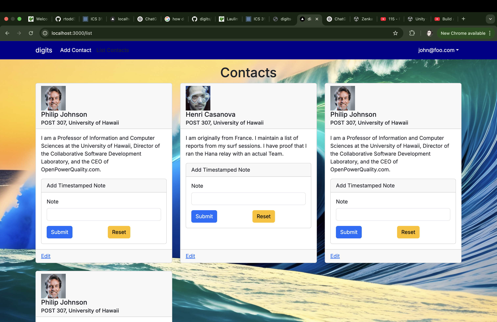
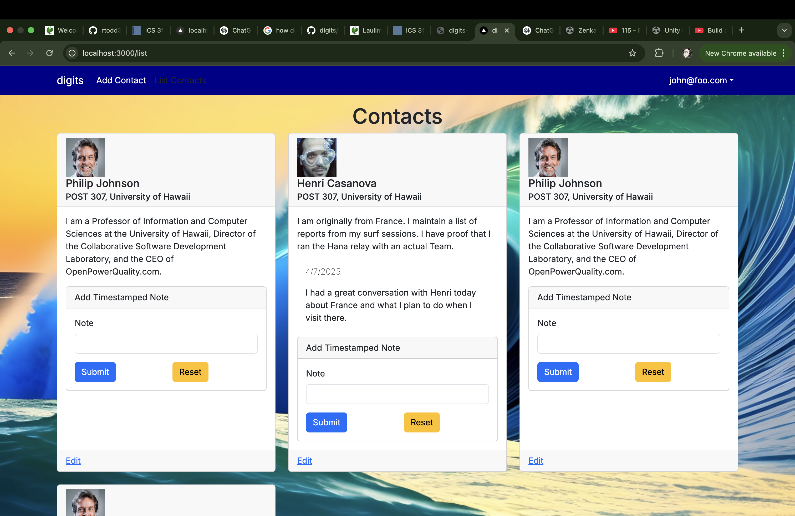
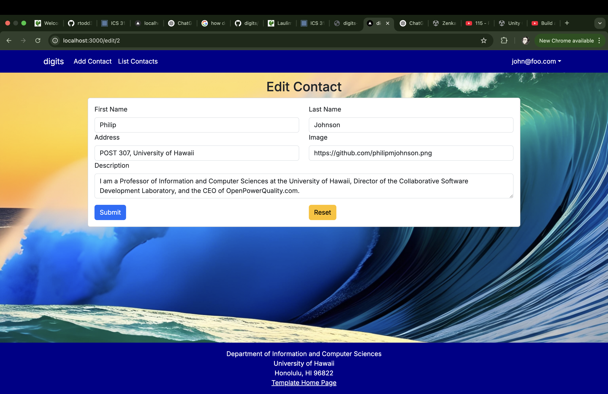
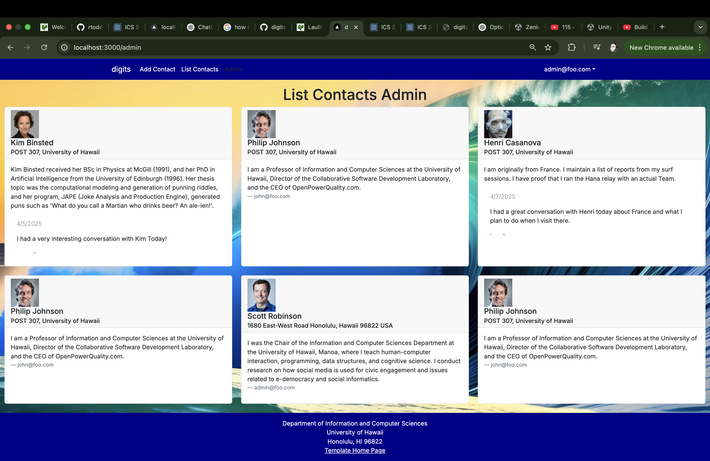

Digits is an application that allows users to:

Register an account.
Create and manage a set of contacts.
Add a set of timestamped notes regarding their interactions with each contact.

## Installation

First, [install PostgreSQL](https://www.postgresql.org/download/).

Second, download a copy of Digits. Note that Digits is a private repo and so you will need to request permission from the author to gain access to the repo.

Third, cd into the app directory install the required libraries with:

```

$ npm install

```

Third, cd into the app directory install the required libraries with:
```

$ npm run dev

```

The first time you run the app, it will create some default users and data. Here is the output:

```

Running seed command `ts-node --compiler-options {"module":"CommonJS"} prisma/seed.ts` ...
Seeding the database
  Creating user: admin@foo.com with role: ADMIN
  Creating user: john@foo.com with role: USER
🌱  The seed command has been executed.
> nextjs-application-template-1@0.1.0 dev
> next dev

  ▲ Next.js 14.2.26
  - Local:        http://localhost:3000
  - Environments: .env

 ✓ Starting...
 ✓ Ready in 2.9s
 ○ Compiling / ...
 ✓ Compiled / in 4.9s (7064 modules)

```

Then seed the database with the `/config/settings.development.json` data using `npx prisma db seed`.

```

$ npx prisma db seed
Environment variables loaded from .env
Running seed command `ts-node --compiler-options {"module":"CommonJS"} prisma/seed.ts` ...
Seeding the database
Creating user: admin@foo.com with role: ADMIN
Creating user: john@foo.com with role: USER
Adding stuff: Basket (john@foo.com)
Adding stuff: Bicycle (john@foo.com)
Adding stuff: Banana (admin@foo.com)
Adding stuff: Boogie Board (admin@foo.com)

🌱 The seed command has been executed.
$

```

If all goes well, the template application will appear at http://localhost:3000. You can login using the credentials in settings.development.json, or else register a new account.

Lastly, you can run ESLint over the code in the imports/ directory with:

```

$ npm run lint

```

## User Interface Walkthrough

# Landing Page
When you first bring up the application, you will see the landing page that provides a brief introduction to the capabilities of Digits:


# Register
If you do not yet have an account on the system, you can register by clicking on “Login”, then “Sign Up”:

# Sign in
Click on the Login link, then click on the Signin link to bring up the Sign In page which allows you to login:


# User home page
After successfully logging in, the system takes you to your home page. It is just like the landing page, but the NavBar contains links to list contact and add new contacts:


# List Contacts
Clicking on the List Contacts link brings up a page that lists all of the contacts associated with the logged in user:



This page also allows the user to add timestamped “notes” detailing interactions they’ve had with the Contact. For example:



# Edit Contacts
From the List Contacts page, the user can click the “Edit” link associated with any Contact to bring up a page that allows that Contact information to be edited:



# Admin Page
It is possible to designate one or more users as “Admins” through the settings file. When a user has the Admin role, they get access to a special NavBar link that retrieves a page listing all Contacts associated with all users:

